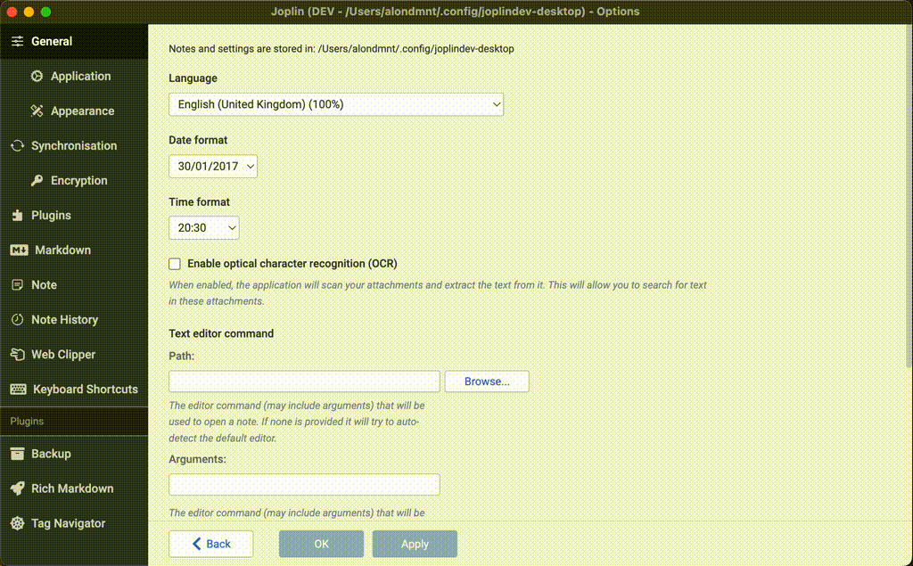

# ☸️ Inline Tag Navigator

[](https://zenodo.org/doi/10.5281/zenodo.10701718) 

Type inline #tags or front matter in the note editor. View your tagged paragraphs and tasks / TODOs in a search panel, or in a generated note. Build a table view / database from notes and tags. Convert between Obsidian tags and Joplin tags.

[Community discussion thread](https://discourse.joplinapp.org/t/plugin-inline-tag-navigator-v0-8-0-2024-06-26/35726)

- [Features](#features)
- [Demos](#demos)
- [Tips](#tips)
- [Companion plugins](#companion-plugins)
- [Motivation](#motivation)
- [Objectives](#objectives)

## Features

This plugin adds inline tag support (such as #inline-tag) to [Joplin](https://joplinapp.org) in five ways:

1. It adds a panel for searching and viewing tagged paragraphs across all your notes ([video](https://www.youtube.com/watch?v=im0zjQFoXb0)).
    - **Save search queries** in notes and sync them across devices ([video](https://www.youtube.com/watch?v=GuzCwYxyYZ0)).
    - **Tag-by-notes:** Search for links or [[wikilinks]] to notes (including backlinks to the current note).
    - **Tag in front matter:** All Markdown front matter fields can be treated as tags ([video](https://www.youtube.com/watch?v=L3zHletRk54)).
    - **Edit tags:** Add, replace and remove inline tags via the panel context menu (right-click on a tag).
    - **Insert tags** from the panel into the note editor ([video](#tag-insertion)).
    - **Toggle checkboxes** / TODOs from the panel, including [[x]it! style](https://xit.jotaen.net) checkboxes (click, or right-click for 6 task states). See also [tips](#inline-todos).
    - **Nested tags** hierarchy: Search parent tags to find the locations of their children ([video](https://www.youtube.com/watch?v=h-HdX7npbIw)). Example: #parent/child.
    - Search for a **range of tags**, according to their lexicographic order. Example: #2024/07 -> #2024/08
    - Search tags by **today's date**. Examples: #today, #today+1 (tomorrow), #today-10 (ten days ago)
2. It can generate a note with all tagged paragaraphs that match a saved query (dynamically updated) ([video](https://www.youtube.com/watch?v=GuzCwYxyYZ0)).
    - Save a query in a note, and switch note view on: `Tools --> Tag Navigator --> Toggle search results display in note` 
    - Display results in a table / database ([video](https://www.youtube.com/watch?v=L3zHletRk54))
3. It adds a panel for quickly navigating between inline tags that appear in the current note, or in all notes ([video](https://www.youtube.com/watch?v=h-HdX7npbIw)).
4. It can convert your existing inline tags to native Joplin tags, so that they are accessible using Joplin's built-in tag search.
5. It can convert your existing native Joplin tags to inline tags, so that they are accessible using inline tag search (this plugin). See also [tips](#converting-joplin-tags).

After installing the plugin, check the commands listed under `Tag Navigator` in the `Tools` menu, as well as the corresponding settings section.

## Demos

- [Inline tag search](#inline-tag-search)
- [Saved search queries](#saved-search-queries)
- [Table view / database](#table-view--database)
- [Navigation panel](#navigation-panel)
- [Tag insertion](#tag-insertion)

### Inline tag search


### Saved search queries


### Table view / database


### Navigation panel


### Tag insertion



## Tips

- [Troubleshooting](#troubleshooting)
- [Custom tag definitions](#custom-tag-definitions)
- [Front matter tags](#front-matter-tags)
- [Inline TODOs](#inline-todos)
- [Keyboard shortcuts](#keyboard-shortcuts)
- [Converting Joplin tags](#converting-joplin-tags)

### Troubleshooting

- If any of the actions on note results does not work (toggling checkboxes, editing tags), this is usually resolved by a database update (Ctrl+Shift+D).

### Custom tag definitions

- The definition of a "tag" can be adjusted with user-defined regular expressions.
    - Example: Every word in the text may be defined as a tag using a custom regex such as `[A-Za-z0-9]+[\w]*`.
- You may also define an exclusion rule to ignore certain tags.
    - Example: Numeric (`#123`) or hexanumeric (`#C0FF1E`) tags can be filtered using an exclusion regex such as `#(\d+|[a-fA-F0-9]{6})$`.

### Front matter tags

For example, the following YAML front matter, when inserted at the top of the note:

```yaml
---
nested: tag with spaces
arrayed: [v1, v2, v3]
tags:
  - tag1
  - tag2
---
```

will be converted to the following inline tags:

```text
#nested/tag_with_spaces
#arrayed/v1
#arrayed/v2
#arrayed/v3
#tag1
#tag2
#frontmatter
```

These tags will be accessible in the search panel / notes / tables like standard inline tags. The last tag is `#frontmatter` and is used to indicate that the tags were extracted from the front matter section of the note.

### Inline TODOs

- Filter results by pending tasks (`"- [ ]"`) or ones done (`"- [x]"`).
- Add support for [additional tags](https://github.com/CalebJohn/joplin-inline-todo?tab=readme-ov-file#confluence-style) for @mentions, +projects and //due-dates using a custom tag regex such as `(?<=^|\s)([#@+]|\/\/)([^\s#@'\"]*\w)`.
- Supported additional checkbox styles (inspired by `[x]it!`).
    - Set any of them to done by clicking the checkbox in the search panel.


- Toggle between all states by right-clicking on a checkbox.


- You may increase the checkbox size on smaller screens by setting `Search: Panel style` with the CSS `.itags-search-checkbox { width: 18px; height: 18px; font-size: 18px }` (adjust as needed).
- Furthermore, every checkbox in the text (even ones that are not tagged by any inline #tag) may be defined as a tag using a custom regex such as `(?<=^|\s)([#]|\-\s\[[x\s@\?!~]\])([^\s#'\"]*\w)?`.
    - You may then use queries to search for tag-tasks based on their state (`- [ ]`, `- [x]`, `- [@]`, ...).

### Keyboard shortcuts

- Default command shortcuts
    - These can be set up in Joplin's keyboard shortcut settings.

| Key | Action |
| --- | ------ |
| Ctrl + Shift + T | Toggle search panel |
| Ctrl + Shift + I | Focus on search panel (search tag / insert tag) |
| Ctrl + Shift + D | Update tag database |
| Ctrl + Shift + L | Load search query from current note |

- Tag / note filter (search panel) shortcuts

| Key | Action |
| --- | ------ |
| Enter | Add tag(s) / note to query / note (see config) |
| 2nd Enter | Search notes based on current query |
| Delete | Remove last added tag / note from query |
| Esc | Clear the filter (display all tags / notes) |
| 2nd Esc | Return to note editor |
| Arrow-Down | Toggle negation of last tag / note in query |
| Arrow-Up | Toggle last operator AND <--> OR |

### Converting Joplin tags

1. It is recommended (as for any other plugin), before converting all notes:
    - Test a few individual notes (one command above the all-note conversion).
    - Backup your note database.
2. If you would like organise your tags hierarchically (using nested tags) rename your Joplin tags first, before the conversion.
    - Example: `#child` -> `#parent/child`
    - You may also choose to rename your inline tags after the conversion, using the plugin's `Replace all` command. However, this will create a divergence between your inline and Joplin tags.
3. Select your preferred conversion settings.
    - Converted inline tags will appear at the top / bottom depending on the `Location` advanced setting.
    - Converted inline tags will have the prefix # depending on the `Tag prefix` advanced setting.
    - The list of converted inline tags will begin with the text 'tags: ' depending on the `List prefix` advanced setting.
    - Spaces in Joplin tags will be converted to inline tags depending on the `Space replacement` advanced setting. When converting inline tags back to Joplin spaces will be introduced back to tags. For example: [Joplin: `tag with space`] -> [inline: `#tag_with_space`] -> [Joplin: `tag with space`]
4. After the conversion all Joplin tags remain assigned to their notes. They are not deleted, and only a single line of text is added to each note.

## Companion plugins

- The excellent [Inline Tags](https://github.com/roman-r-m/joplin-inline-tags-plugin) plugin can autocomplete tags while typing.
- You can highlight tags in the Markdown editor using [Rich Markdown](https://github.com/CalebJohn/joplin-rich-markdown) (version ≥ 0.14).
    - In `Joplin settings --> Rich Markdown --> Advanced Settings --> Custom classes JSON` enter:
    ```
    [{"name": "rm-tag", "regex": "(?<=^|\\s)#([^\\s#'\"]*\\w)"}]
    ```
    - In `Joplin settings --> Appearance --> Custom stylesheet for Joplin-wide app styles` add the following to the style sheet:
    ```
    div.CodeMirror .cm-rm-tag {
        background-color: #7698b3;
        color: white !important;
        padding: 0em 2px;
        border-radius: 5px;
        display: inline;
    }
    ```
    - On the mobile app, since it is impossible to edit the stylesheet, one could install this [Rich Markdown fork](https://github.com/alondmnt/joplin-rich-markdown/releases/tag/v0.15-mobile-style-v4) (with predefined support for tags and checkboxes) or instead define the name of the tag class to be `"name": "searchMatch"`. This will use the same highlighting style as Joplin search results.

## Motivation

- Notes are arguably the atomic blocks of information in [Joplin](https://joplinapp.org). They can be linked to, tagged, and come up in search results. Joplin is optimised for this, and these features are pretty efficient.
- However, among 100s-1000s of long-form notes (that are hardly "atomic"), it remains challenging to find a small piece of information, idea, or memory.
- Tags can be especially helpful in distinguishing between the content of a text (what it's about) and its form or function (what type of text it is or what purpose it serves). The first is more easily captured by traditional or [semantic search](https://github.com/alondmnt/joplin-plugin-jarvis). The latter can be conveniently captured by tags, such as #concept, #plan, #memory, #realisation, #idea, #review, #bug, #feature, and others.
- I'd like to experiment here with information retrieval from single paragraphs, or outline items, as atomic blocks of information, using inline tags.

## Objectives

1. Be able to tag and efficiently search single paragraphs among all notes, using tags and free text.
2. Browse the entire content of these paragraphs without having to open each note.
3. Make this accessible and user-friendly.
