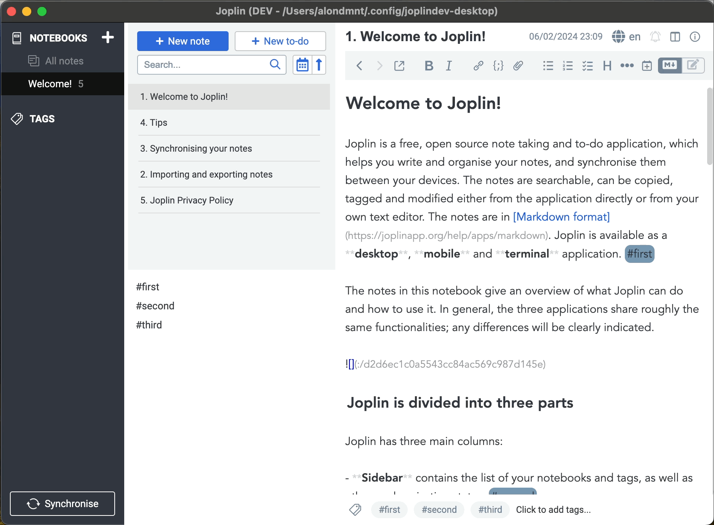

# Inline Tag Navigator

Type inline #tags in the note editor. View your tagged paragraphs and list items in an advanced search panel, or in a generated note. Convert inline and Obsidian tags into Joplin tags, and vice versa.

## Features

This plugin adds inline tag support (such as #inline-tag) to [Joplin](https://joplinapp.org) in five ways:

1. It adds a panel for searching and viewing tagged paragraphs across all your notes ([video](https://www.youtube.com/watch?v=im0zjQFoXb0)).
    - Save favourite search queries in notes and sync them across devices ([video](https://www.youtube.com/watch?v=xIBZl2Ala9A)).
    - Tag-by-notes: Search for links or [[wikilinks]] to notes (including backlinks to the current note).
    - Add, replace and remove inline tags via the panel context menu (right-click on a tag).
    - Toggle checkboxes / TODOs from the panel.
2. It can generate a note with all tagged paragaraphs that match a saved query (dynamically updated).
    - Save a query in a note, and switch note view on: `Tools --> Tag Navigator --> Toggle search results display in note` 
3. It adds a panel for quickly navigating between inline tags that appear in the current note.
4. It can convert your existing inline tags to native Joplin tags, so that they are accessible using Joplin's built-in tag search.
5. It can convert your existing native Joplin tags to inline tags, so that they are accessible using inline tag search (this plugin).

After installing the plugin, check the commands listed under `Tag Navigator` in the `Tools` menu, as well as the corresponding settings section.

## Demos

- Watch the tag search demo on YouTube:

<a href="https://www.youtube.com/watch?v=im0zjQFoXb0"></a>

- Watch the navigation panel demo:



## Tips

- If any of the actions on note results does not work (toggling checkboxes, editing tags), this is usually resolved by a database update (Ctrl+Shift+D).
- The definition of a "tag" can be adjusted with user-defined regular expressions.
    - For example, every word in the text may be defined as a tag using a custom regex such as `[A-Za-z0-9]+[\w]*`.
- Inline TODOs:
    - Filter results by pending tasks (`"- [ ]"`) or ones done (`"- [x]"`).
    - Add support for [additional tags](https://github.com/CalebJohn/joplin-inline-todo?tab=readme-ov-file#confluence-style) for @mentions, +projects and //due-dates using a custom tag regex such as `(?<=^|\s)([#@+]|\/\/)([^\s#@+]*\w)`.
- Tag / note filter keyboard shortcuts:

| Key | Action |
| --- | ------ |
| Enter | Add tag / note to query |
| 2nd Enter | Search notes based on current query |
| Delete | Remove last added tag / note from query |
| Esc | Clear the filter (display all tags / notes) |
| Arrow-Down | Toggle negation of last tag / note in query |
| Arrow-Up | Toggle last operator AND <--> OR |

## Companion plugins

- The excellent [Inline Tags](https://github.com/roman-r-m/joplin-inline-tags-plugin) plugin can autocomplete tags while typing.
- You can highlight tags in the Markdown editor using [Rich Markdown](https://github.com/CalebJohn/joplin-rich-markdown) (version ≥ 0.14).
    - In `Joplin settings --> Rich Markdown --> Advanced Settings --> Custom classes JSON` enter:
    ```
    [{"name": "rm-tag", "regex": "(?<=^|\\s)#([^\\s#]*\\w)"}]
    ```
    - In `Joplin settings --> Appearance --> Custom stylesheet for Joplin-wide app styles` add the following to the style sheet:
    ```
    div.CodeMirror .cm-rm-tag {
        background-color: #7698b3;
        color: white !important;
        padding: 0em 0.2em;
        border-radius: 0.5em;
        display: inline;
    }
    ```

## Motivation

- Notes are arguably the atomic blocks of information in [Joplin](https://joplinapp.org). They can be linked to, tagged, and come up in search results. Joplin is optimised for this, and these features are pretty efficient.
- However, among 100s-1000s of long-form notes (that are hardly "atomic"), it remains challenging to find a small piece of information, idea, or memory.
- Tags can be especially helpful in distinguishing between the content of a text (what it's about) and its form or function (what type of text it is or what purpose it serves). The first is more easily captured by traditional or [semantic search](https://github.com/alondmnt/joplin-plugin-jarvis). The latter can be conveniently captured by tags, such as #concept, #plan, #memory, #realization, #idea, #review, #bug, #feature, and others.
- I'd like to experiment here with information retrieval from single paragraphs, or outline items, as atomic blocks of information, using inline tags.

## Objectives

1. Be able to tag and efficiently search single paragraphs among all notes, using tags and free text.
2. Browse the entire content of these paragraphs without having to open each note.
3. Make this accessible and user-friendly.

[](https://zenodo.org/doi/10.5281/zenodo.10701718)
