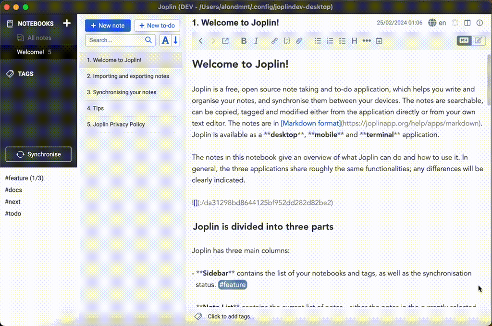
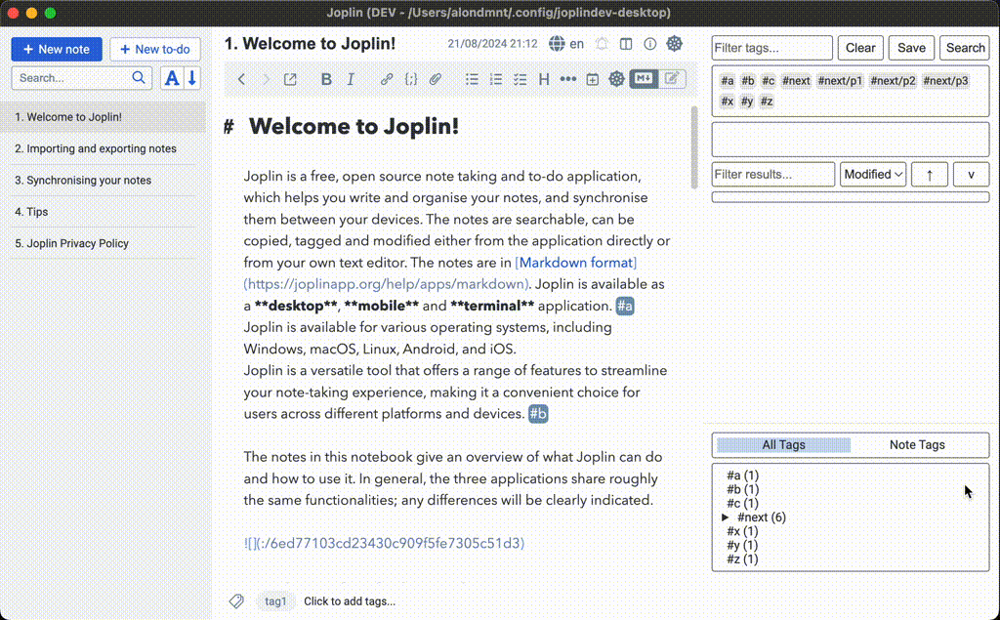
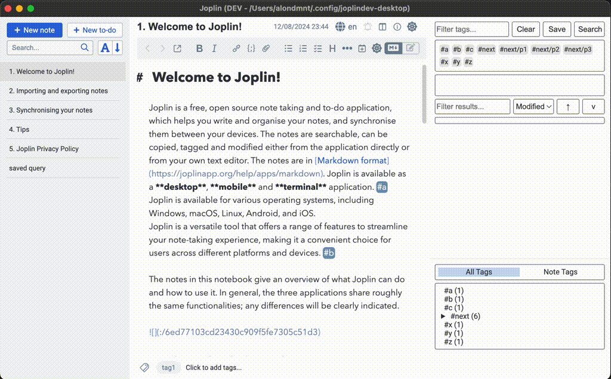
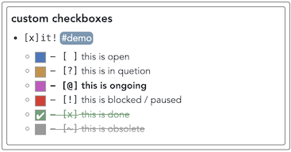
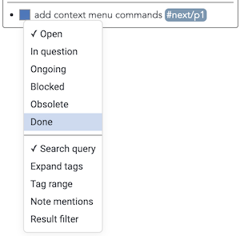
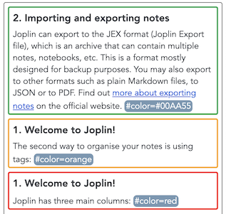

# ☸️ Inline Tag Navigator

[](https://zenodo.org/doi/10.5281/zenodo.10701718) 

Type inline tags or frontmatter in the note editor. View your tagged paragraphs and tasks / TODOs in a search panel, or in a generated note / kanban. Build a table view / database from notes and tags. Convert between Obsidian tags and Joplin tags.

- [Community discussion thread](https://discourse.joplinapp.org/t/plugin-inline-tag-navigator-v0-8-0-2024-06-26/35726)
- [Release notes](CHANGELOG.md)
- [Quick Start](#quick-start)
- [Features](#features)
- [Demos](#demos)
- [Tips](#tips)
- [Companion plugins](#companion-plugins)
- [Motivation](#motivation)
- [Objectives](#objectives)

## Quick Start

Get started in 3 steps:

1. **Add tags to your notes**: Type `#project`, `#todo`, `#idea`, or any `#tag-name` in your note text.
2. **Search your tags**: In the search panel, click a tag to add it to your query, then press Enter to search. Results show all matching paragraphs across your notes.
3. **Interact with results**: Click checkboxes to toggle task states, or right-click on tags and results for more options (edit tags, switch between 6 task states, show/hide panel sections).

For video tutorials, see the [Demos](#demos) section or the [full playlist](https://www.youtube.com/playlist?list=PLV4DhNiuF20XCdqNEo1a190dkNFo69rd-).

## Features

This plugin adds inline tag support (such as #inline-tag) to [Joplin](https://joplinapp.org) in six ways:

1. It adds a panel for searching and viewing tagged paragraphs across all your notes. ([video](https://www.youtube.com/watch?v=im0zjQFoXb0))
    - **Search queries**: Search tags using logical operators (AND, OR, NOT), and using free text in the note, title, or notebook name / path.
    - **Save search queries** in notes and sync them across device. ([video](https://www.youtube.com/watch?v=GuzCwYxyYZ0), [tips](#saved-queries))
    - **Sort results by tags** such as priorities, dates, colors, or any other tag. ([video](https://www.youtube.com/watch?v=HvunHOc2zlM), [tips](#saved-queries))
    - **Tag-by-notes:** Search for links or [[wikilinks]] to notes (including backlinks to the current note).
    - **Tag in front matter:** All Markdown front matter fields can be treated as tags. ([video](https://www.youtube.com/watch?v=L3zHletRk54), [tips](#front-matter-tags))
    - **Edit tags:** Add, replace and remove inline tags via the panel context menu (right-click on a tag).
    - **Search / extend query from the editor**: Right-click on a tag in the editor to search for it or add it to the current query.
    - **Insert tags** from the panel into the note editor. ([tips](#tag-insertion))
    - **Toggle checkboxes** / TODOs from the panel, including [[x]it! style](https://xit.jotaen.net) checkboxes (click, or right-click for 6 task states). ([tips](#inline-todos))
    - **Nested tags** hierarchy: Search parent tags to find the locations of their children. Example: #parent/child. ([video](https://www.youtube.com/watch?v=h-HdX7npbIw))
    - **Tag values**: Assign values to tags. Example: #tag=value. ([tips](#tag-values))
    - **Tag ranges**: Search for a range of tags, according to their lexicographic order. Example: #2024/07 -> #2024/08. ([tips](#tag-ranges))
    - **Date tags**: Search tags by today's date, this month, or a day in the current week. Examples: #today, #today+1 (tomorrow), #week+1 (Monday). ([tips](#date-tags))
    - **Colour tags**: Use colour tags to highlight results in the search panel. Example: #color=red. ([tips](#colour-tags))
    - **Context expansion**: Reveal surrounding lines around search results to see more context. ([tips](#context-expansion))
2. It can generate a note with all tagged paragaraphs that match a saved query (dynamically updated). ([video](https://www.youtube.com/watch?v=GuzCwYxyYZ0), [tips](#saved-queries))
    - Save a query in a note, and switch note view on: `Tools --> Tag Navigator --> Toggle search results display in note` .
    - Display results:
        - In sections (similarly to the the panel).
        - In a table / database. ([video](https://www.youtube.com/watch?v=L3zHletRk54), [tips](#table-views))
        - In a kanban board. ([video](https://www.youtube.com/watch?v=e7HhQJjpEJg), [tips](#kanban-views))
3. It adds a panel for quickly navigating between inline tags that appear in the current note, or in all notes ([video](https://www.youtube.com/watch?v=h-HdX7npbIw)).
    - Click a global tag to search for it, or Cmd/Ctrl+click to add it to the current query.
4. It can convert your existing inline tags to native Joplin tags, so that they are accessible using Joplin's built-in tag search.
5. It can convert your existing native Joplin tags to inline tags, so that they are accessible using inline tag search (this plugin). ([tips](#converting-joplin-tags))
6. It renders inline tags and front matter in the Markdown preview, and front matter in the Markdown editor. ([tips](#styling-inline-tags))

After installing the plugin, check the commands listed under `Tag Navigator` in the `Tools` menu, as well as the corresponding settings section.

## Demos

- [All video tutorials](https://www.youtube.com/playlist?list=PLV4DhNiuF20XCdqNEo1a190dkNFo69rd-)
- [Inline tag search](#inline-tag-search)
- [Saved search queries](#saved-search-queries)
- [Sort results by tags, and date tags actions](https://www.youtube.com/watch?v=HvunHOc2zlM)
- [Table view / database](#table-view--database)
- [Kanban view](https://www.youtube.com/watch?v=e7HhQJjpEJg)
- [Navigation panel](#navigation-panel)

### Inline tag search



### Saved search queries



### Table view / database


### Navigation panel



## Tips

### Getting Started
- [Troubleshooting](#troubleshooting)
- [Saved queries](#saved-queries)
- [Keyboard shortcuts](#keyboard-shortcuts)

### Working with Tags
- [Custom tag definitions](#custom-tag-definitions)
- [Tag inheritance](#tag-inheritance)
- [Date tags](#date-tags)
- [Tag insertion](#tag-insertion)
- [Tag ranges](#tag-ranges)
- [Tag values](#tag-values)
- [Front matter tags](#front-matter-tags)

### Views & Display
- [Table views](#table-views)
- [Kanban views](#kanban-views)
- [Filtering results](#filtering-results)
- [Context expansion](#context-expansion)
- [Colour tags](#colour-tags)
- [Styling inline tags](#styling-inline-tags)

### Advanced
- [Inline TODOs](#inline-todos)
- [Converting Joplin tags](#converting-joplin-tags)

### Troubleshooting

- If any of the actions on note results does not work (toggling checkboxes, editing tags), this is usually resolved by a database update (Ctrl+Shift+D).

### Custom tag definitions

- The definition of a "tag" can be adjusted with user-defined regular expressions (see the advanced setting `Tag regex`).
- You may also define an exclusion rule to ignore certain tags (see the advanced setting `Exclude regex`).

<details>
<summary>Regex examples</summary>

- **Custom tag regex**: Every word in the text may be defined as a tag using a custom regex such as `[A-Za-z0-9]+[\w]*`.
- **Exclusion regex**: Numeric (`#123`) or hexanumeric (`#C0FF1E`) tags can be filtered using an exclusion regex such as `#(\d+|[a-fA-F0-9]{6})$`.

</details>

### Tag inheritance

> **TL;DR:** Tags automatically apply to child content via indentation, headings, or note-level inheritance.

- Tag inheritance allows tags to be automatically applied to related content based on document structure, making it easier to organize and find information without manually tagging every line.
- When the `Tag inheritance` setting is enabled (by default), tags are automatically inherited in three ways:
    1. **Outline/indentation inheritance**: Tags are inherited from parent items to their children based on indentation levels.
        - Example: If `#project/website` appears on a parent line, all indented child lines will also be tagged with `#project/website`
    2. **Heading inheritance**: Tags are inherited from headings to all content under that heading.
        - Example: If `## Meeting Notes #urgent` appears as a heading, all other *tagged lines* under that heading will also be tagged with `#urgent`
    3. **Top of the note inheritance**: Tags are inherited from the first 2 lines of the note.
        - Example: If the first line in the note has `tags: #project/website #urgent`, all other *tagged lines* in the note will also be tagged with both tags.
        - Example: If a tag appears in the YAML [front matter](#front-matter-tags) of the note, all other *tagged lines* in the note will have front matter tags.

### Date tags

> **TL;DR:** Use `#today`, `#week`, `#month` for dynamic dates. Add arithmetic like `#today+7`.

Date tags provide flexible ways to work with dates in your notes, supporting both relative dates that update automatically and absolute dates that remain fixed.

#### Relative date tags

- **Today tags**: Use `#today` for the current date, or add arithmetic like `#today+7` (one week from today) or `#today-10` (ten days ago).
    - Example: `#today` becomes `#2025-01-15` (if today is January 15, 2025)
    - Example: `#today+20` becomes `#2025-02-04` (twenty days from today)
- **Month tags**: Use `#month/01` for the 1st of the current month, `#month/15` for the 15th, etc.
    - Example: `#month/01` becomes `#2025-07-01` (if the current month is July 2025)
    - Useful for recurring monthly deadlines like reports or reviews
- **Week tags**: Use `#week` for the start of the current week, or add arithmetic like `#week+7` (next week).
    - Example: `#week` becomes `#2025-01-13` (if the current week starts on January 13, 2025)
    - The start day of the week can be configured in settings
- **Nested date tags**: Date arithmetic works in nested tag structures, enabling dynamic date ranges with semantic context.
    - Example query: `#deadline/#today -> #deadline/#today+30` finds all deadlines in the next 30 days
    - Results like: `#deadline/2025-11-09`, `#deadline/2025-12-09` (date prefix is stripped from nested parts)
    - Example query: `#project/milestone/#week -> #project/milestone/#week+14` finds project milestones in the coming two weeks
    - In notes, write absolute dates directly: `#deadline/2025-12-09`
    - **Note**: To use date arithmetic in nested tags directly in notes (e.g., `#deadline/#today+30`), customize the tag pattern in Settings → Tag Navigator → Tag regex by removing `#` from the exclusion list: `(?<=^|\s)#([^\s'",.()\[\]:;\?\\]+)`

#### Converting relative to absolute dates

- Use the **Replace date tags command** (`Ctrl+Alt+D`) to convert relative date tags to absolute ones in the current lines.
    - Example: `#today+20` becomes `#2025-02-04` (fixed date that won't change)
    - Useful when you need permanent deadlines for project planning
    - Found in `Tools --> Tag Navigator --> Replace date tags in current lines`

#### Customising date tag settings

- **Tag patterns**: You can customise the date tag patterns in the advanced settings:
    - `Date tags: Today` - Change from `#today` to your preferred pattern (e.g., `#today`, `#now`, `#date`)
    - `Date tags: Month` - Change from `#month` to your preferred pattern (e.g., `#month`, `#monthly`)
    - `Date tags: Week` - Change from `#week` to your preferred pattern (e.g., `#week`, `#weekly`)
- **Date formats**: Customise how dates are formatted using [date-fns format strings](https://date-fns.org/docs/format):
    - `Date tags: Date format` - Default: `#yyyy-MM-dd` (e.g., `#2025-01-15`)
    - `Date tags: Month format` - Default: `#yyyy-MM` (e.g., `#2025-01`)
    - `Date tags: Week format` - Default: `#yyyy-MM-dd` (e.g., `#2025-01-13`)
    - Tip: Use a nested date structure to make dates hierarchical and sortable, such as `#yyyy/MM/dd`
- **Week start day**: Configure which day starts the week (Sunday through Saturday) in `Date tags: Week start day`

### Tag insertion

- You may insert a tag into the note editor by:
    - Starting to type a tag in the search panel, and pressing `Shift+Enter`.
    - Right-clicking on a tag in the search panel, and selecting `Insert tag`.

### Tag ranges

> **TL;DR:** Search tag ranges with `#min -> #max`. Use `*` wildcard for prefix/suffix matching.

- Tag ranges can be used to search for a range of tags, according to their lexicographic order.
    - Example: `#2024/07 -> #2024/08` will search for all tags starting with `#2024/07` and up to `#2024/08` (inclusive, i.e., returning two months).
    - Note: Non-wildcard ranges require both min and max values to avoid unexpected matches across different tag types.
- You may also use ranges with the `*` wildcard to search for tags starting with a certain prefix or ending with a suffix.
    - Example: `#prefix* ->` will search for all tags starting with `#prefix`.
    - Example: `-> *suffix` will search for all tags ending with `suffix`.
    - Wildcard ranges can be open-ended (only min or max specified).
- Tag ranges can be inserted using the "Tag range" input boxes, or by right-clicking on a tag in the query area, and selecting `Edit query`.
    - Example: Edit a tag or tag range and type `#prefix* ->` to search for all tags starting with `#prefix`.
    - If you type only `#prefix`, the query will be converted to a standard tag search (matching only the tag `#prefix`).
- Tag ranges can be used to search for tags by today's date.
    - Example: `#today -> #today+7` will search for all tags from today up to a week from now (inclusive).
    - Example: `#today -> #today+1` will search for all tags starting with `#today` and up to `#today+1` (inclusive, i.e., returning two days).

### Tag values

> **TL;DR:** Use `#tag=value` to assign values. Unlike nested tags, values don't clutter the tag list.

Tag values are a bit similar to nested tags as multiple parts of the tag are treated separately, but are distinct from them as explained below.

- Nested tags like `#parent/child` are shown as two separate tags in panels: `#parent` and `#parent/child`.
- Tag values like `#parent=value` are shown as a single tag in panels: `#parent`.
    - This is useful when you wish to assign many different values to a single tag, and prefer to avoid displaying all of them.
- As with nested tags, you may search for `#parent`, and may also search for `#parent=value`, or use tag ranges.
    - In order to search for a tag value, right-click on a tag in the query area, and select `Edit query`.
    - You may then add the `=` operator to the tag, and enter the value you would like to search for.
- The value operator can be customised in the plugin settings.
- It should also be noted that while nested tags are widely used in note apps, tag values are less common.

### Front matter tags

> **TL;DR:** YAML front matter fields are converted to inline tags automatically.

For example, the following YAML front matter, when inserted at the top of the note:

<details>
<summary>View YAML front matter example</summary>

```yaml
---
nested: tag with spaces
arrayed: [v1, v2, v3]
tags:
  - tag1
  - tag2
---
```

will be converted to the following inline tags and values:

```text
#nested=tag_with_spaces
#arrayed=v1
#arrayed=v2
#arrayed=v3
#tag1
#tag2
#frontmatter
```

</details>

These tags will be accessible in the search panel / notes / tables like standard inline tags. The last tag is `#frontmatter` and is used to indicate that the tags were extracted from the front matter section of the note.

### Saved queries

> **TL;DR:** Save search configurations as JSON. Press `Save` on the panel, or edit manually. Switch between queries using the dropdown.

Saved queries allow you to store search configurations in notes and reuse them across devices. They are JSON objects that define search parameters and display options. The easiest way to save a query in the current note is to press the `Save` button on the panel (see the [demo](#saved-search-queries)), but they can also be edited manually.

#### Loading saved queries

- A dropdown in the search panel lists all notes containing saved queries, allowing you to quickly switch between them.
- When you navigate to a note with a saved query, it is automatically loaded into the search panel.
- To disable automatic loading (for a static panel that only updates via explicit query selection), turn off the setting `Search: Auto-load saved queries from notes`.

#### Basic structure

```json
{
  "query": [
    [
      {
        "tag": "#tag-name",
        "negated": false
      }
    ]
  ],
  "filter": "",
  "displayInNote": "false"
}
```

#### Core properties

- **`query`**: Array of search terms (tags, notes, ranges)
  - Outer array represents OR groups
  - Inner arrays represent AND groups within each OR group
  - Each tag term has:
    - `tag`: The search term (tag, note link, or text)
    - `negated`: Boolean indicating whether to exclude this term
  - Each note term has:
    - `title`
    - `externalId`: The note's Joplin ID
    - `negated`
  - Each range term has:
    - `minValue`
    - `maxValue`
- **`filter`**: String for additional text filtering within results
- **`displayInNote`**: Display mode when viewing in notes
  - `"false"`: Do not show results
  - `"list"`: List results, similarly to panel
  - `"table"`: Display as a table/database view
  - `"kanban"`: Display as a kanban board for tasks

#### Advanced options

- **`sortBy`**: Comma-separated list of parent / value tags to sort by
- **`sortOrder`**: Comma-separated list of sort directions
  - Use "a" / "asc" / "ascend" or "d" / "desc" / "descend"
  - Must correspond to columns in `sortBy`
- **`resultGrouping`**: (List / no view only) How to group the search results
  - `"heading"`: Group by heading
  - `"consecutive"`: Group adjacent lines
  - `"item"`: Split by item
  - `"none"`: No grouping (flat list) — each paragraph becomes its own card, enabling cross-note sorting by tag
  - To change the global grouping, right-click on a note title in the search panel. Saved queries can override this with their own `resultGrouping` property.
- **`includeCols`**: (Table view only) Comma-separated list of columns to display
  - Can include: note properties, tags, "modified", "created" timestamps
  - Use to slice, sort, or add specific columns
  - Supports rename syntax `col:Display Name` to set custom header labels (e.g. `"status:Current Status, priority:Priority Level"`)
- **`excludeCols`**: (Table view only) Comma-separated list of columns to hide
  - Removes columns even if they exist in the data
- **`limit`**: Maximum number of results to display (positive integer)
  - Applied after sorting and filtering

#### Complete example

<details>
<summary>View complete JSON example</summary>

```json
{
  "query": [
    [
      {
        "tag": "#artist",
        "negated": false
      },
      {
        "tag": "#album",
        "negated": false
      }
    ],
    [
      {
        "tag": "#single",
        "negated": false
      }
    ]
  ],
  "filter": "rock",
  "displayInNote": "table",
  "options": {
    "includeCols": "title, artist, country:Country of Origin, year, modified",
    "excludeCols": "notebook, line",
    "sortBy": "year, artist",
    "sortOrder": "asc, desc",
    "limit": 20
  }
}
```

This example searches for paragraphs that have both `#artist` AND `#album` tags, OR paragraphs with `#single` tag, then filters results containing "rock" anywhere in the text, and displays them in a table sorted by year (ascending) then by artist (descending). The `country` column header is renamed to "Country of Origin".

</details>

### Table views

- To enable table view, start by [saving a query](#saved-queries). Next, select `Tools --> Tag Navigator --> Toggle search results display in note` (or the corresponding toolbar button) until the saved query shows the property `"displayInNote": "table"` and a table appears.
- Quickly add new entries to the table by clicking on `New table entry note` in the context menu, toolbar, or Tag Navigator menu.
    - The new note will contain a [front matter](#front-matter-tags) template with properties for each column.
- Tables can be customised using the following settings:
    - `Note view: Table view columns`: Set the default number of columns (most common ones) to display in the table view.
    - `Search: Extract the full notebook path`: Enable this to display the notebook path in the table view, and to allow [filtering results](#filtering-results) by this path.
    - `Note view: Note view: Tag case in table view`: Set to "Title Case" / "lowercase".
- Table views, like any other type of note view, can be updated periodically using the settings: `Note view: Periodic update of tag search view in notes` and `Database / Note view: Update after sync`.
- Tables can be customised per note using with table-specific options. See the [saved queries](#saved-queries) section for complete specifications and examples.

### Kanban views

- To enable kanban view, start by [saving a query](#saved-search-queries). Next, select `Tools --> Tag Navigator --> Toggle search results display in note` (or the corresponding toolbar button) until the saved query shows the property `"displayInNote": "kanban"` and a kanban board appears.
- The kanban board organises tasks by their checkbox state:
    - `- [ ]` Open tasks
    - `- [@]` Ongoing tasks 
    - `- [?]` Tasks in question
    - `- [!]` Blocked tasks
    - `- [x]` Done tasks
    - `- [~]` Obsolete tasks
- The kanban note is read only.
    - Tasks can be moved between states by clicking on the checkbox in the search panel.
    - Like other note views, it updates automatically as you modify tasks in your notes.
        - When you open the kanban note;
        - Or when you press `Note view: Refresh` (Ctrl + Shift + R).
- Sub-task logic: For tasks with sub-tasks, the kanban column is determined by the parent checkbox if it exists, otherwise by the completion status of the sub-tasks. For example, `- [ ] Deploy to production` with completed sub-tasks appears in the Open column because the parent task isn't checked. But `- Website launch preparation` (no parent checkbox) with all sub-tasks completed appears in the Done column.
- Kanban views, like any other type of note view, can be updated periodically using the settings: `Note view: Periodic update of tag search view in notes` and `Database / Note view: Update after sync`.
- You may use the [YesYouKan](https://github.com/joplin/plugin-yesyoukan) plugin to visualise the note as a kanban board.

### Filtering results

- Text entered in the results filter (on the panel or in a saved query) can be used to search within title of the notes, their notebook name / path, or the content of the displayed results.
- Filtering behaviour depends on the result grouping mode (right-click a note title on the panel to change):
    - **Group by heading** (default): Shows/hides entire sections based on whether they contain matching content.
    - **Split by item**: Shows/hides individual items, useful for filtering specific tasks like `"- [ ]"`.
    - **No grouping**: Each paragraph is a separate card, enabling sorting across notes by tag (e.g., due dates, priorities).
- To gain more control over filtering by notebook, you may enable the setting `Search: Extract the full notebook path`.
    - Example: Limit results to a notebook that appears in the top level by searching for `|/topNotebook`.
    - Example: Search for `topNotebook/childNotebook` to show only results from childNotebook.
- You may exclude entire notebooks (and their sub-notebooks) from the tag database by right-clicking on a notebook and selecting "Exclude notebook" or "Un-exclude notebook", or by manually editing the setting `Database: Exclude notebooks`. To process only specific notebooks, configure the `Database: Include notebooks` setting with a comma-separated list of notebook IDs.
- Use the `!` prefix to exclude terms from filter results.
    - Example: `project !archive` includes results containing "project" but excludes those containing "archive".
    - Example: `"!references/"` excludes notebooks containing "references" in their path.
- You may also enable `Search: Use regex for tag / note / content filtering` to filter using regular expressions.

### Context expansion

Context expansion lets you reveal surrounding lines around search results to see more context without opening the note.

- Click the **↑** arrow on any search result section to show more lines above and below the matched content.
- Click again to expand further (up to 3 levels).
- When fully expanded, click **↓** to collapse back to the original view.
- The expanded context is dimmed to help distinguish it from the core matched lines.
- Configure the number of lines revealed per click in the setting `Search: Context expansion (show surrounding lines)`. Set to 0 to disable.
- **Panel sections**: Show/hide panel sections (search query, tag list, tag range, note mentions, result filter) by right-clicking anywhere on the panel.

### Inline TODOs

- Filter results by pending tasks (`"- [ ]"`) or ones done (`"- [x]"`). For individual task filtering, use "Split by item" grouping (right-click a note title on the panel).
- Sort results by tags to reflect their priority (see [custom sorting options](#advanced-options)).
<details>
<summary>Custom regex for @mentions, +projects, //due-dates</summary>

- Add support for [additional tags](https://github.com/CalebJohn/joplin-inline-todo?tab=readme-ov-file#metalist-style) for @mentions, +projects and //due-dates using a custom tag regex such as `(?<=^|\s)([#@+]|\/\/)([^\s#@'",.()\[\]:;\?\\]+)`.

</details>
- Supported additional checkbox styles (inspired by `[x]it!`).
    - Set any of them to done by clicking the checkbox in the search panel.



- Toggle between all states by right-clicking on a checkbox.



- You may increase the checkbox size on smaller screens by setting `Search: Panel style` with the CSS `.itags-search-checkbox { width: 18px; height: 18px; font-size: 18px }` (adjust as needed).
<details>
<summary>Custom regex for treating checkboxes as tags</summary>

- Every checkbox in the text (even ones that are not tagged by any inline #tag) may be defined as a tag using a custom regex such as `(?<=^|\s)(#([^\s#'",.()\[\]:;\?\\]+)|(\-\s\[[x\s@\?!~]\]))`.
    - You may then use queries to search for tag-tasks based on their state (`- [ ]`, `- [x]`, `- [@]`, ...).

</details>

### Colour tags

- Colour tags can be used to highlight results in the search panel, e.g., according to their priority.
    - Example: `#color=MediumSeaGreen`, `#color=#008080` or `#color=rgb(0, 128, 128)`.
    - HTML colour names are supported.
- You may customise the colour tag in the plugin settings.
    - Example: Set it to be `#priority/`, and then tag by `#priority/red`.
- You may select whether to paint the background, the border of the results with the selected colour, or note titles in note views.
    - See the settings: `Search: Use color to set result: Border / Background`, `Note view: Display colors`.
- Set the colour of an entire note by tagging one of its first 2 lines with the colour tag.
- Different sections of the same note may be tagged with different colours. They will be displayed separately in the panel (see an example below).



### Styling inline tags

The Markdown preview pane and the Tag Navigator search panel wrap every matched tag in the class `itags-search-renderedTag` and, when the token starts with `#`, `@`, `+`, `//`, or any other character, add `itags-search-renderedTag--hash`, `--at`, `--plus`, `--slash`, `--<other char>`. You may modify their appearance in `userstyle.css` (for Markdown preview), or in the `Search: Panel style` setting (for the plugin's search panel).

<details>
<summary>CSS example for tag styling</summary>

```css
/* optional: specify different sub-styles for each type of tag */
.itags-search-renderedTag {
	background-color: #a576b3ff;
} /* global style */

.itags-search-renderedTag--at {
	background-color: #6fae4a;
} /* type-specific style */

.itags-search-renderedTag--plus {
	background-color: #ae4a6f;
}

.itags-search-renderedTag--slash {
	background-color: #4a6fae;
}
```

</details>

For the Markdown editor see Rich Markdown in the [Companion plugins](#companion-plugins) section.

### Keyboard shortcuts

- Default command shortcuts
    - These can be set up in Joplin's keyboard shortcut settings.

| Key | Action |
| --- | ------ |
| Ctrl + Alt + N | Toggle navigation panel |
| Ctrl + Shift + T | Toggle search panel |
| Ctrl + Shift + I | Focus on search panel (search tag / insert tag) |
| Ctrl + Shift + R | Refresh the current note view |
| Ctrl + Shift + D | Update tag database |
| Ctrl + Alt + D   | Replace date tags in current lines |
| Ctrl + Shift + L | Load search query from current note |

- Tag / note filter (search panel) shortcuts

| Key | Action |
| --- | ------ |
| Enter | Add tag(s) / note to query / note (see config) |
| Shift + Enter | Insert first tag to note |
| 2nd Enter | Search notes based on current query |
| Delete | Remove last added tag / note from query |
| Esc | Clear the filter (display all tags / notes) |
| 2nd Esc | Return to note editor |
| Arrow-Down | Toggle negation of last tag / note in query |
| Arrow-Up | Toggle last operator AND <--> OR |

### Converting Joplin tags

1. It is recommended (as for any other plugin), before converting all notes:
    - Test a few individual notes (one command above the all-note conversion).
    - Backup your note database.
2. If you would like organise your tags hierarchically (using nested tags) rename your Joplin tags first, before the conversion.
    - Example: `#child` -> `#parent/child`
    - You may also choose to rename your inline tags after the conversion, using the plugin's `Replace all` command. However, this will create a divergence between your inline and Joplin tags.
3. Select your preferred conversion settings.
    - Converted inline tags will appear at the top / bottom depending on the `Location` advanced setting.
    - Converted inline tags will have the prefix # depending on the `Tag prefix` advanced setting.
    - The list of converted inline tags will begin with the text 'tags: ' depending on the `List prefix` advanced setting.
    - Spaces in Joplin tags will be converted to inline tags depending on the `Space replacement` advanced setting. When converting inline tags back to Joplin spaces will be introduced back to tags. For example: [Joplin: `tag with space`] -> [inline: `#tag_with_space`] -> [Joplin: `tag with space`]
    - Enable the `Tag conversion tracking` setting to intelligently track converted tags for automatic cleanup when removing or modifying Joplin and inline tags. This helps maintain consistency between your Joplin tags and inline tags when you make changes to either system.
4. After the conversion all Joplin tags remain assigned to their notes. They are not deleted, and only a single line of text is added to each note.

## Companion plugins

- The excellent [Inline Tags](https://github.com/roman-r-m/joplin-inline-tags-plugin) plugin can autocomplete tags while typing.
- Use [YesYouKan](https://github.com/joplin/plugin-yesyoukan) to visualize kanban views generated by Tag Navigator as interactive kanban boards.
- You can highlight tags in the Markdown editor using [Rich Markdown](https://github.com/CalebJohn/joplin-rich-markdown) (version ≥ 0.14).

<details>
<summary>Rich Markdown setup instructions</summary>

- In `Joplin settings --> Rich Markdown --> Advanced Settings --> Custom classes JSON` enter:
```
[{"name": "rm-tag", "regex": "(?<=^|\\s)#([^\\s#'\",.()\\[\\]:;\\?\\\\]+)"}]
```
- In `Joplin settings --> Appearance --> Custom stylesheet for Joplin-wide app styles` add the following to the style sheet:
```
div.CodeMirror .cm-rm-tag {
    background-color: #7698b3;
    color: white !important;
    padding: 0em 2px;
    border-radius: 5px;
    display: inline;
}
```
- On the mobile app, since it is impossible to edit the stylesheet, one could install this [Rich Markdown fork](https://github.com/alondmnt/joplin-rich-markdown/releases/tag/v0.15-mobile-style-v4) (with predefined support for tags and checkboxes) or instead define the name of the tag class to be `"name": "searchMatch"`. This will use the same highlighting style as Joplin search results.

</details>

## Motivation

- Notes are arguably the atomic blocks of information in [Joplin](https://joplinapp.org). They can be linked to, tagged, and come up in search results. Joplin is optimised for this, and these features are pretty efficient.
- However, among 100s-1000s of long-form notes (that are hardly "atomic"), it remains challenging to find a small piece of information, idea, or memory.
- Tags can be especially helpful in distinguishing between the content of a text (what it's about) and its form or function (what type of text it is or what purpose it serves). The first is more easily captured by traditional or [semantic search](https://github.com/alondmnt/joplin-plugin-jarvis). The latter can be conveniently captured by tags, such as #concept, #plan, #memory, #realisation, #idea, #review, #bug, #feature, and others.
- I'd like to experiment here with information retrieval from single paragraphs, or outline items, as atomic blocks of information, using inline tags.

## Objectives

1. Be able to tag and efficiently search single paragraphs among all notes, using tags and free text.
2. Browse the entire content of these paragraphs without having to open each note.
3. Make this accessible and user-friendly.
